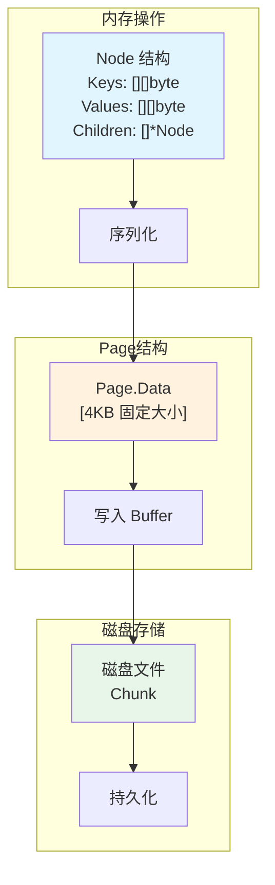
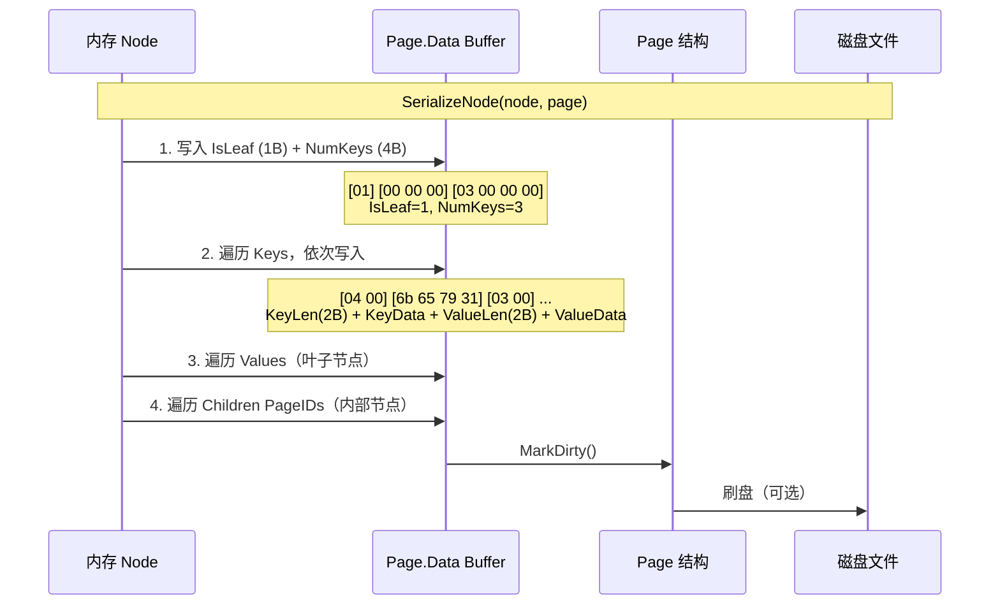
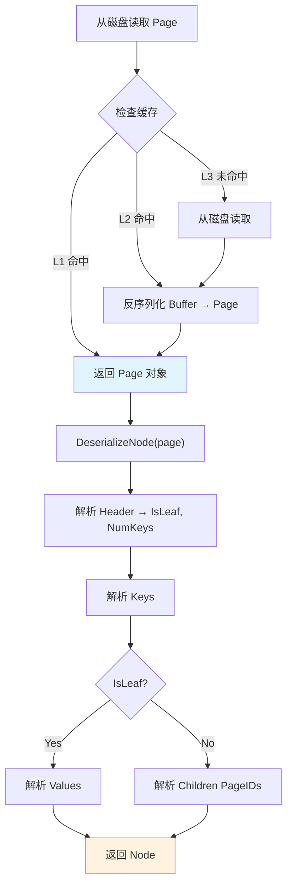
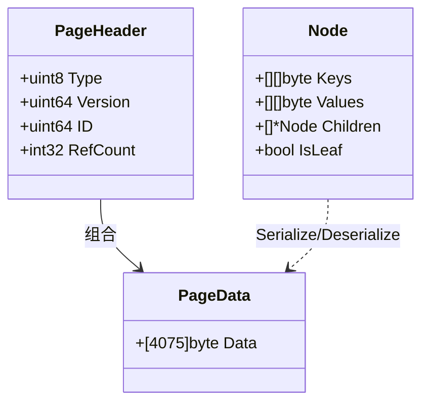
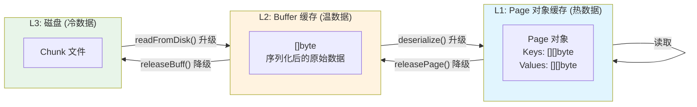
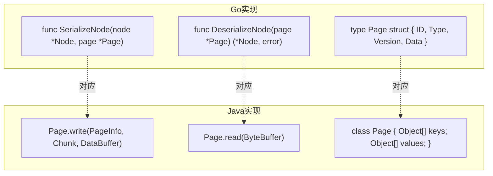

# KV → Page 序列化详解

## 一、整体架构



## 二、序列化流程



## 三、Page 内存布局

```mermaid
graph LR
    subgraph Page 结构 (4KB = 4096 bytes)
        H["Page Header<br/>21 bytes"]
        D["Page Data<br/>4075 bytes"]
    end
    
    subgraph Header 详解
        H --> H1["Type: 1 byte"]
        H --> H2["Version: 8 bytes"]
        H --> H3["ID: 8 bytes"]
        H --> H4["RefCount: 4 bytes"]
    end
    
    subgraph Data 布局
        D --> D1["Metadata<br/>5 bytes"]
        D --> D2["Keys Section<br/>变长"]
        D --> D3["Values Section<br/>变长"]
        D --> D4["Children Section<br/>变长"]
    end
    
    style H fill:#ffcdd2
    style D fill:#c8e6c9
```

## 四、反序列化流程



## 五、详细数据格式



## 六、三层缓存与序列化



## 七、关键代码对应



## 八、序列化示例

### 输入：Node

```go
node := &Node{
    IsLeaf: true,
    Keys:   [][]byte{[]byte("key1"), []byte("key2")},
    Values: [][]byte{[]byte("val1"), []byte("val2")},
}
```

### 输出：Page.Data

```
Offset  Bytes                          Content
─────────────────────────────────────────────────────────────
0       01                            IsLeaf = 1 (true)
1       00 00 00                     Padding
4       02 00 00 00                 NumKeys = 2

6       04 00                        Key[0] Length = 4
8       6b 65 79 31                  Key[0] = "key1"
12      05 00                        Value[0] Length = 5
14      76 61 6c 75 31               Value[0] = "val1"

19      03 00                        Key[1] Length = 3
21      6b 65 79                     Key[1] = "key2"
24      05 00                        Value[1] Length = 5
26      76 61 6c 75 31               Value[1] = "val1"
...     ...                          (后续可能有 padding)
```

## 九、关键要点

| 要点 | 说明 |
|------|------|
| **固定 Page 大小** | 4KB 固定，避免内存碎片 |
| **变长字段** | Key/Value 用 Length + Data 格式 |
| **序列化方向** | Node → Page → Disk |
| **反序列化** | Disk → Page → Node（按需） |
| **三层缓存** | L1: Page 对象, L2: Buffer, L3: Disk |
| **CCOW 兼容** | Version 字段支持并发版本 |

---

**生成日期**: 2026-03-09
**主题**: KV → Page 序列化详解
