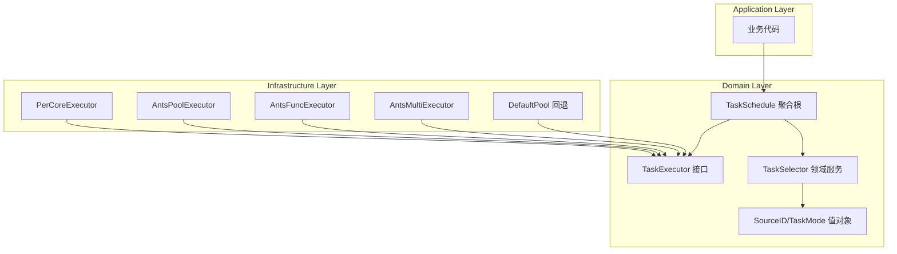

# PR-088: 统一任务调度器架构

> **类型**: Feature
> **状态**: Pre Review
> **日期**: 2026-02-27
> **Spike 文档**: `docs/07_spike/2026-02-26-spike-unified-task-scheduler.md`

---

## 1. 需求背景

### 1.1 问题陈述

当前 NexKV 项目使用 `ants` 协程池作为唯一的任务调度方式，存在以下问题：

| 问题 | 影响 | 严重性 |
|------|------|--------|
| **延迟敏感模块无法保证** | HLC 时钟、WAL 写入等核心模块与普通任务共享池，P99 延迟不可控 | 高 |
| **缺乏模式选择** | 所有场景使用同一池，无法针对不同负载优化 | 中 |
| **扩展性受限** | 新增调度策略需要修改现有代码 | 中 |
| **可观测性不足** | 缺乏细粒度的任务调度监控指标 | 低 |

### 1.2 目标

设计并实现**统一任务调度器架构**，支持：

1. **4 种显式调度模式** + **1 种隐式回退模式**
2. **SourceID 路由机制**：根据来源自动选择最优调度模式
3. **DDD 分层架构**：Domain/Infrastructure 职责分离
4. **分阶段性能目标**：500K → 1M → 2M ops/s

---

## 2. 设计方案

### 2.1 架构概览



### 2.2 五种调度模式

| 模式 | 类型 | 说明 | 适用场景 |
|------|------|------|---------|
| **ModePerCore** | 显式 | 每核单 goroutine，支持 CPU 绑定 | HLC、WAL、Transpose |
| **ModeCustomPool** | 显式 | ants 自定义池 | 通用场景 |
| **ModeFuncPool** | 显式 | ants 函数池 | 高频重复任务 |
| **ModeMultiPool** | 显式 | ants 多池 | 分片场景 |
| **ModeDefaultPool** | 隐式回退 | ants 默认池 | 临时任务、测试 |

### 2.3 接口设计

```go
// 3 个核心接口（简化版）
type TaskExecutor interface {
    Submit(ctx context.Context, task func(context.Context)) error
}

type TaskExecutorWithArg interface {
    SubmitWithArg(ctx context.Context, task func(context.Context, any), arg any) error
}

type TaskExecutorWithResult interface {
    SubmitWithResult(ctx context.Context, task func(context.Context) (any, error)) TaskResult[any]
}

// 聚合根入口
type TaskSchedule struct {
    // 内部管理所有 Executor
}

func (s *TaskSchedule) Submit(ctx context.Context, sourceID SourceID, task func(context.Context)) error
```

### 2.4 分阶段实施

| 阶段 | 目标 | 交付物 | 预计时间 |
|------|------|--------|----------|
| **Phase 1** | 基础架构 | PerCoreExecutor + TaskSelector + 基础测试 | 2 周 |
| **Phase 2** | 完整功能 | 4 种 Ants Executor + 优先级队列 | 2 周 |
| **Phase 3** | 性能优化 | 性能调优 + 监控集成 | 1 周 |

---

## 3. 风险评估

### 3.1 技术风险

| 风险 | 可能性 | 影响 | 缓解措施 |
|------|--------|------|----------|
| **Per-Core 跨平台兼容性** | 中 | 高 | macOS fallback 到 LockOSThread |
| **并发安全问题** | 中 | 高 | 专家评审已修复 P0 问题 |
| **性能目标不达** | 中 | 中 | 分阶段验证，Phase 1 目标 500K ops/s |
| **迁移成本** | 低 | 中 | 渐进式迁移，旧 API 保持兼容 |

### 3.2 已修复的 P0 问题

| 问题 | 修复方案 |
|------|----------|
| allDone Channel 泄漏 | Close() 添加超时强制关闭 |
| submitRequest.result Channel 泄漏 | 带缓冲 channel + 清空机制 |
| coreWorker 锁管理 | defer + 局部作用域 |
| 聚合根缺失 | 添加 TaskSchedule 聚合根 |

### 3.3 依赖变更

| 依赖 | 版本 | 用途 |
|------|------|------|
| `github.com/panjf2000/ants/v2` | 现有 | 协程池基础 |
| `golang.org/x/time/rate` | 新增 | DoS 防护 |
| `github.com/prometheus/client_golang` | 现有 | 可观测性 |

---

## 4. 测试策略

### 4.1 单元测试

- TaskMode/SourceID 值对象验证
- TaskSchedule 聚合根行为测试
- 各 Executor 接口契约测试

### 4.2 并发测试

- `go test -race` 竞态条件检测
- `go.uber.org/goleak` goroutine 泄漏检测
- 1000 goroutine 并发压力测试

### 4.3 性能测试

```go
// Phase 1 目标
BenchmarkPerCoreExecutor-4   500000   2500 ns/op   P99 < 50μs
```

---

## 5. 兼容性

### 5.1 向后兼容

- ✅ 现有 `TaskPoolProvider` 接口保持不变
- ✅ `AntsTaskPoolProvider` 实现保持不变
- ✅ 新代码可选择使用 `TaskSchedule`

### 5.2 迁移路径

```
现有代码 → 保持使用 AntsTaskPoolProvider
新代码   → 使用 TaskSchedule.Submit(sourceID, task)
```

---

## 6. 待架构师评审

- [ ] DDD 分层架构是否合理？
- [ ] 5 种调度模式是否足够？
- [ ] 性能目标是否现实？
- [ ] 风险缓解措施是否充分？
- [ ] 是否批准进入实施阶段？

---

**文档版本**: v1.0
**最后更新**: 2026-02-27
