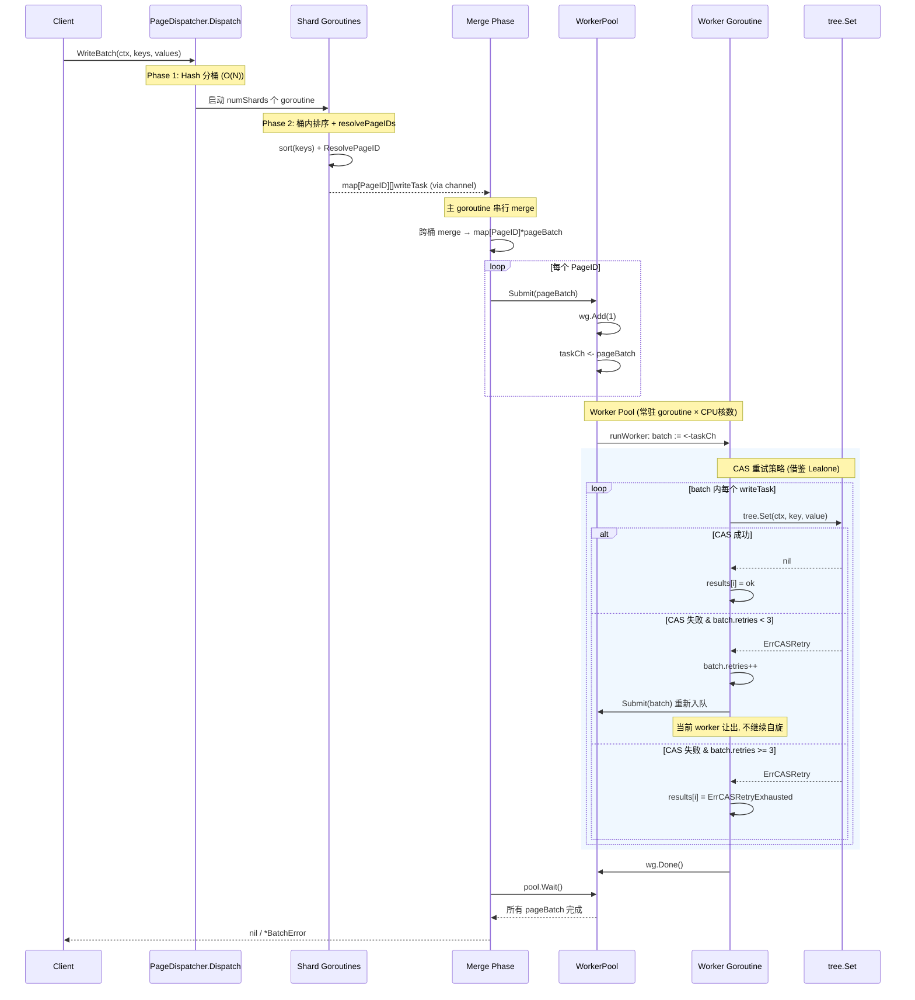

# BTree 并行写入调度器设计

> 状态：v5（Agent 评审修订） | 日期：2026-05-25 | 分支：`fix/btree-par-put-stability`

## 1. 问题定义

### 现状

BTree 写操作基于乐观锁（CAS on PageInfo），高并发下多个 goroutine 争抢同一 Page 的 CAS → 重试风暴 → 大量 involuntary CS → 调度颠簸 → 吞吐暴跌且极不稳定。

```
当前模型：无差别并发
  goroutine-1 ─┐
  goroutine-2 ─┤  CAS 争抢同一 Page
  goroutine-3 ─┤  ─→ 失败 → 重试 → 更多 CS
  goroutine-4 ─┘
```

### 目标

- 同 Page 写入**串行化**，消除 CAS 竞争
- 跨 Page 写入**并发**，保持多核利用
- 消除双峰分布，CV 降到 5% 以下

### V1 范围（明确边界）

**V1 包含**：批量非事务写入的并行调度（`WriteBatch`）。

**V1 不包含**：
- **事务支持**：NexKV 已有完整的 MVCC 事务层（SnapshotTx、WAL-based 2PC、VersionChain GC），PageDispatcher V1 不介入事务调度。事务写入直接走现有 `tree.Set` + MVCC 路径，不经 PageDispatcher。
- **单 key 写入**：`tree.Set` 单次调用走现有 CAS 路径不变。

事务调度（事务内跨 Page 读一致性、事务/非事务混批、与 WAL 集成）留待 V2 独立设计。

## 2. 核心思想

```
                    ┌─ Page-A Queue → Worker-A (串行)
                    │
KV 写入请求 ─→ 按 Page 分片 ─┼─ Page-B Queue → Worker-B (串行)
                    │
                    └─ Page-C Queue → Worker-C (串行)
```

**原则**：
- **同 Page 串行**：同一 Page 的 Set 操作排入该 Page 的队列，单 goroutine 消费
- **跨 Page 并发**：不同 Page 的队列由不同 goroutine 消费，互不干扰

## 3. Key → Page 映射策略

### 3.1 策略对比

| 策略 | 准确度 | 开销 | 适用场景 |
|------|:------:|:----:|---------|
| A. 完整 BTree 遍历 | 100% | O(log N) per key | 通用 |
| B. 批量排序遍历 | 100% | O(N log N) 一次 | 批量写入 |
| C. **Hash 分桶** | N/A (非映射，纯扇出) | O(1) | 通用 |
| D. Root ChildrenCache 路由 | 粗粒度 | O(log M) | M = 根节点子页数 |

### 3.2 推荐方案：Hash 分桶 + 桶内排序遍历（C + B）

**设计原则**：Phase 1 用 hash 将 key 均匀扇出到 N 个桶（O(1) per key，无锁），桶间并行处理。Phase 2 在桶内排序 key 后一次 BTree 遍历解析 PageID。

**为什么不用前缀分桶**：benchmark key 全部以 `"key-"` 开头，前缀分桶把所有 key 分入同一桶，Phase 1 退化为空操作。hash 分桶保证任意 key 分布下的均匀性。

**Phase 1 — Hash 分桶（策略 C）**：

```go
// KeyToShard 使用 FNV-1a hash 将 key 映射到固定数量的分片
// 保证均匀分布，不依赖 key 的前缀语义
const numShards = 64

func KeyToShard(key []byte) int {
    h := fnv.New32a()
    h.Write(key)
    return int(h.Sum32() % numShards)
}
```

**Phase 2 — 桶内排序 + 批量遍历（策略 B）**：

```go
// resolveShardPageIDs 对单个 shard 内的 key 排序后批量解析 PageID
// 利用 key 有序性：相邻 key 大概率同 page，减少遍历次数
func (tree *BTree) resolveShardPageIDs(ctx context.Context, keys []keyWithIndex) map[PageID][]int {
    // 1. 桶内排序（shard 内 key 数量 ≈ N/numShards，可控）
    sort.Slice(keys, func(i, j int) bool {
        return bytes.Compare(keys[i].key, keys[j].key) < 0
    })

    // 2. 顺序遍历解析 PageID
    // 相邻 key 大概率同 page，记录上次的 searchPath 加速
    result := make(map[PageID][]int)
    var lastPage PageID
    for i, k := range keys {
        var pid PageID
        if i > 0 && tree.inSamePage(lastPage, k.key) {
            pid = lastPage // 快速路径：复用上次结果
        } else {
            pid = tree.ResolvePageID(ctx, k.key)
            lastPage = pid
        }
        result[pid] = append(result[pid], k.idx)
    }
    return result
}
```

**错误路径**：若 `ctx` 被取消，`resolveShardPageIDs` 通过 `ResolvePageID(ctx, key)` 感知取消并提前返回 error。主 goroutine 收集所有 shard 结果（通过 channel 或 error slice），任一 shard 失败则整体快速失败。

`inSamePage` 是一个纯读优化：从 page 的 key range 元数据快速判断 key 是否在范围内。**错误判定的后果可控**：
- False positive（认为在范围内但实际已分裂）→ 下游 `tree.Set` 通过 `searchPath` 正确路由到新 Page，正确性不受影响，仅性能略降
- False negative（认为不在范围内但实际在）→ 重新 `ResolvePageID`，仅性能略降

### 3.3 分片数与桶数

```
numShards = GOMAXPROCS * 4   // 固定 64 桶（M2 8 核 → 32）
```

- 桶数固定为 CPU 核数 × 4，不随 key 数量变化
- 每个桶内 key 数量 ≈ N/numShards，桶内排序开销可控
- 桶间无锁并行，桶数 > 核数确保负载均衡

## 4. 调度器架构

### 4.1 数据结构

```go
// PageDispatcher 按 Page 分片调度写入
type PageDispatcher struct {
    tree     *btree.BTree
    pool     *WorkerPool
}

// WorkerPool 常驻 worker goroutine 池，消费 per-page 任务
type WorkerPool struct {
    taskCh    chan *pageBatch   // 所有 worker 共享的任务通道
    wg        sync.WaitGroup   // 追踪所有提交的任务
}

// pageBatch 单个 Page 的批量写入任务
type pageBatch struct {
    ctx       context.Context
    tree      *btree.BTree
    pageID    PageID
    tasks     []writeTask
    results   []WriteResult
    nextIdx   int              // 下次执行起始位置（re-queue 时跳过已完成的 key）
    retries   int              // CAS 失败重新入队计数（上限 3）
}

// writeTask 单个写入任务（不含 channel，纯数据）
type writeTask struct {
    idx   int      // 在原始 keys 数组中的位置
    key   []byte
    value []byte
}

// WriteResult 单个写入的结果
type WriteResult struct {
    Index int
    Err   error
}
```

**关键变更（v1→v2）**：
- 去掉 `WriteTask.ErrCh`、`PageQueue.done` — channel 开销太大，改用预分配 `[]WriteResult` + 索引映射
- 去掉 `txnCh` — 事务在 Dispatch 内联执行，不通过通道
- `WorkerPool` 使用常驻 goroutine + 共享 `taskCh`，而非 per-task `go func()`

### 4.2 调度流程

```
┌─────────────────────────────────────────────────────┐
│                 PageDispatcher.Dispatch()            │
│                                                      │
│  1. Hash 分桶: O(N)，key 扇出到 numShards 个桶       │
│         │                                             │
│         ▼                                             │
│  2. 桶间并行: 每个桶开 goroutine，通过 sync.WaitGroup 等待     │
│     ├─ 桶0: 排序 + resolveShardPageIDs → 返回 map[PageID][]int    │
│     ├─ 桶1: 排序 + resolveShardPageIDs → 通过 channel/slice 返回  │
│     └─ 桶N: 排序 + resolveShardPageIDs → 主 goroutine 收集        │
│         │                                             │
│         ▼                                             │
│  3. 串行合并: 主 goroutine WaitGroup.Wait() 所有 shard 完成         │
│     后逐桶 merge（推荐用 errgroup.Group 管理 shard goroutine）       │
│         │                                             │
│         ▼                                             │
│  4. 提交: 每个 PageID → WorkerPool.Submit(pageBatch) │
│         │                                             │
│         ▼                                             │
│  5. 等待: wp.wg.Wait()                                │
│         │                                             │
│         ▼                                             │
│  6. 汇总 WriteResult[] 返回                           │
└─────────────────────────────────────────────────────┘
```

### 4.3 Worker Pool

```go
// NewWorkerPool 创建 n 个常驻 worker goroutine
func NewWorkerPool(n int) *WorkerPool {
    wp := &WorkerPool{
        taskCh: make(chan *pageBatch, n*4),
    }
    for i := 0; i < n; i++ {
        go wp.runWorker()
    }
    return wp
}

// runWorker 常驻 goroutine，消费 taskCh 上的 pageBatch
func (wp *WorkerPool) runWorker() {
    for batch := range wp.taskCh {
        wp.executeBatch(batch)
    }
}

// executeBatch 串行执行同一 Page 的所有写入
// 借鉴 Lealone 双层重试策略：CAS 失败 3 次后重新入队而非自旋
// nextIdx 确保 re-queue 后跳过已完成的 key（幂等安全）
func (wp *WorkerPool) executeBatch(batch *pageBatch) {
    defer wp.wg.Done()

    var panicked any
    defer func() {
        if r := recover(); r != nil {
            panicked = r // 只设标志，不在 recover 内做复杂操作
        }
        if panicked != nil {
            // 仅标记未完成的 task（nextIdx 及之后的）
            for i := batch.nextIdx; i < len(batch.tasks); i++ {
                batch.results[i] = WriteResult{
                    Index: batch.tasks[i].idx,
                    Err:   fmt.Errorf("worker panic: %v", panicked),
                }
            }
        }
    }()

    for i := batch.nextIdx; i < len(batch.tasks); i++ {
        t := &batch.tasks[i]
        err := batch.tree.Set(batch.ctx, t.key, t.value)

        // 借鉴 Lealone：CAS 失败不是继续自旋，而是让出线程，重新入队等待下一轮
        if err != nil && isCASRetryErr(err) && batch.retries < maxCASRequeue {
            batch.nextIdx = i  // 跳过已完成的 [0..i-1]，下次从第 i 个继续
            batch.retries++
            wp.Submit(batch)   // 重新入队，等待下一轮调度
            return             // 当前 worker 让出
        }

        batch.results[i] = WriteResult{Index: t.idx, Err: err}
    }
}

// Submit 提交一个 pageBatch，不阻塞调用者
func (wp *WorkerPool) Submit(batch *pageBatch) {
    wp.wg.Add(1)
    wp.taskCh <- batch
}

// Wait 等待所有已提交任务完成
func (wp *WorkerPool) Wait() {
    wp.wg.Wait()
}

// Shutdown 优雅关闭
func (wp *WorkerPool) Shutdown() {
    close(wp.taskCh)
}
```

**CAS 重试策略（借鉴 Lealone）**：

```
快速路径：tree.Set 内部 CAS 尝试（当前最多 200 次→改为最多 3 次）
慢速路径：3 次 CAS 失败 → 不再自旋 → Submit(batch) 重新入队 → 当前 worker 让出
         → 下一轮 runWorker 从 taskCh 拿到 batch → 再次尝试
         → 最多重新入队 3 次 → 仍失败则返回错误
```

与 Lealone 的对应：
- Lealone：`try 3 times → register to scheduler wait queue → next loop retry`
- PageDispatcher：`try 3 times → Submit(batch) re-enqueue → next worker picks up`

**工作原理**：



**关键设计决策**：

1. **常驻 goroutine** 而非 per-task `go func()`：避免高频 goroutine 创建/销毁开销
2. **wg.Add(1) 在 Submit 中，在 taskCh 发送之前**：消除 `dispatchNormal` 循环结束后 `Wait()` 的竞态
3. **无 semaphore**：常驻 worker 数量固定 = CPU 核数，自然限流
4. **panic recovery**：recover 内只设标志，循环结束后批量处理，防止嵌套 panic 泄漏 `wg.Done()`
5. **CAS 失败→重新入队而非自旋**：消除 involuntary CS 的根源。`tree.Set` 需要暴露 `SetWithRetry(ctx, key, value, maxRetries)` 方法
6. **`nextIdx` 偏移**：re-queue 后跳过已完成的 key，避免重复执行。`tree.Set` 幂等性保证即使极端情况下也安全
7. **隐式背压**：`taskCh` buffer 为 `n*4`（8 核 → 32）。Page 数 > buffer 时 `Submit` 阻塞，主 goroutine 等待——这是预期行为，不必显式控制。若 Page 数极大（> 10K），可 `make(chan *pageBatch, max(n*8, len(pageGroups)/2))`

### 4.4 关键并发保证

```
Invariant 1: 同一 PageID 的所有写入在同一个 goroutine 中顺序执行
    → 保证：pageBatch 整体提交到一个 worker，worker 内顺序 for 循环

Invariant 2: 不同 PageID 的写入分布到不同 worker 并发执行
    → 保证：不同 pageBatch 进入 taskCh，由 N 个 worker 并行消费

Invariant 3: 跨 Dispatch 调用的同 Page 写入不保证在同一 goroutine
    → 说明：每次 Dispatch 独立提交 pageBatch，
      同一 Page 在不同 batch 中可能由不同 worker 处理。
      但同一 batch 内不变式 1 保证了串行。
```

## 5. 事务兼容（V2 规划）

### 5.1 V1 定位：纯批量写入优化器

PageDispatcher V1 **不介入事务调度**。NexKV 已有完整的 MVCC 事务层：

```
mvcc 事务路径（V1 不变）:
  BeginTx → WriteBuffer (Put/Delete) → PreCheck
  → WAL TxPrepare → get commitTS → applyWriteBuffer
  → BTree.Set per-key (under KeyLock) → WAL TxCommit

PageDispatcher 路径（V1 新增）:
  WriteBatch(keys, values) → Hash分桶 → resolvePageIDs
  → WorkerPool.Submit → 每 Page 串行 tree.Set
```

事务写入仍走现有 `tree.Set` + MVCC 路径。PageDispatcher 的 `WriteBatch` 仅用于非事务批量写入。

**为什么 V1 不做事务调度**：

| 缺失能力 | 说明 | 依赖 |
|---------|------|------|
| 跨 Page 读一致性 | 事务内 Scan 多 Page 需要一个全局快照点，与调度器的分 Page 并发模型冲突 | 需事务快照隔离层 |
| 事务回滚 | V1 Dispatch 只有「成功写」和「CAS 失败重入队」，无 Abort/Rollback 语义 | 需与 WAL + VersionChain 集成 |
| 事务/非事务混批原子性 | 同一 batch 中 K1 成功、Txn 失败时 K1 不可回滚 | 需 2PC 跨 key 原子性 |
| 与现有 WAL 2PC 衔接 | Phase 3.2-3.3 已实现 TxPrepare/TxCommit WAL 类型 | 需事务调度器感知 WAL 边界 |

### 5.2 V2 方向

V2 事务调度器需独立设计，至少覆盖：

1. **事务读快照建立**：事务开始时在 BTree COW 树上建立读快照点
2. **阶段化调度**：Begin → ReadSet → WriteBuffer → PreCheck → Commit（而非黑盒 Execute）
3. **WAL 集成**：利用现有 TxPrepare/TxCommit WAL 类型保证跨 key 原子性
4. **回滚路径**：Abort 时 WriteBuffer 丢弃 + VersionChain 回退
5. **事务内并发**：不同 Page 的写操作在 barrier 间可并发（类似 Palm Tree Stage 3-4）
6. **统一调度器**：事务调度与 PageDispatcher 共享 WorkerPool，避免多 pool 上下文切换开销

V2 设计不在本文档范围内。

## 6. API 设计

### 6.1 调度器接口

```go
// BatchWriter 批量写入调度器（V1：纯非事务批量写入）
type BatchWriter struct {
    dispatcher *PageDispatcher // PageDispatcher 内含 tree，此处不重复
}

// WriteBatch 批量写入（非事务）
// 内部自动按 Page 分组、并发调度
// 返回 error：全部成功返回 nil，部分失败返回 *BatchError
func (bw *BatchWriter) WriteBatch(ctx context.Context, keys, values [][]byte) error

// BatchError 聚合多个写入错误
type BatchError struct {
    Errors []WriteResult // 只包含失败的
}

func (be *BatchError) Error() string {
    return fmt.Sprintf("%d write(s) failed", len(be.Errors))
}
```

**API 设计说明**：
- 返回 `error` 而非 `[]error`，符合 Go 惯例
- 正常路径（无错误）返回 `nil`，零分配
- 需要逐 key 错误时，类型断言 `*BatchError` 获取详情

### 6.2 与现有 BTree API 的关系

```
现有 API (保持兼容):
  tree.Set(ctx, key, value)        // 单 key 写入，直接调现有 CAS 路径
  tree.Get(ctx, key)               // 读取不受影响（lock-free 路径保持）

新增 API:
  batchWriter.WriteBatch(...)       // 批量写入优化路径
  batchWriter.WriteTxn(...)         // 事务写入路径
```

**不破坏现有 API**。`Set` 单次调用走现有 CAS 路径不变。`WriteBatch` 是新增的高性能批量路径。

**读路径不受影响**：`Get` 走 `searchPath` lock-free 路径，不经过调度器。读操作可以在批量写入期间并发执行，读到的是 COW 页面的一致快照。

## 7. 数据流

### 7.1 批量写入时序

```
Client
  │
  │ WriteBatch(ctx, keys=[k1..kN], values=[v1..vN])
  ▼
BatchWriter
  │
  │ 1. Hash 分桶: O(N)，key → shard index
  ▼
  │ 2. 桶间并行 (numShards 个 goroutine):
  │    ├─ 桶0: sort → resolveShardPageIDs → map[PageID][]writeTask
  │    ├─ 桶1: sort → resolveShardPageIDs → map[PageID][]writeTask
  │    └─ ...
  ▼
  │ 3. 跨桶 merge: map[PageID][]writeTask (去重合并)
  ▼
PageDispatcher
  │
  │ 4. Submit: 每个 PageID → pageBatch → taskCh
  ├─→ Worker-1: batch{pA: [k1,k5,k9]}  → tree.Set(k1), Set(k5), Set(k9)  // 串行
  ├─→ Worker-2: batch{pB: [k2,k6]}     → tree.Set(k2), Set(k6)           // 串行
  └─→ Worker-3: batch{pC: [k3,k7,k8]}  → tree.Set(k3), Set(k7), Set(k8)  // 串行
  │
  │ 5. pool.Wait() → 所有 pageBatch 完成
  ▼
  │ 6. 收集 results → 返回 error (nil 或 *BatchError)
  ▼
Client
```

### 7.2 关键保证

- **同 Page 操作顺序执行**：不会有两个 goroutine 同时 CAS 同一 Page
- **零 CAS 重试**（理想情况）：每个 Page 只有一个写者，CAS 一次成功
- **跨 Page 真并发**：不同 Page 的写入完全并行，没有共享竞争
- **同 Page 跨 batch 可并发**：两个 `WriteBatch` 调用中同一 Page 可能由不同 worker 处理，此时退化到原有 CAS 竞争——但单次 batch 内 100% 无竞争
- **调用者约束**：`WriteBatch` 和 `tree.Set` 混用同一 Page 会引入 CAS 竞争。V1 期望调用者按路径隔离：批量写入走 `WriteBatch`，单 key 写入走 `tree.Set`，不要在同一 Page 上混用

## 8. 关键设计决策

### 8.1 Hash 分桶

| 选择 | 优点 | 缺点 |
|------|------|------|
| 前缀分桶（v1） | 实现简单 | **不可用**：顺序 key 同前缀，退化为单桶 |
| **Hash 分桶（v2）** | 均匀分布，通用性强 | 打散同 page 的 key 到不同桶 |
| 去掉 Phase 1，直接全局排序 | 分组最精确 | O(N log N) 单线程，延迟高 |

**选择：Hash 分桶**。同 page 的 key 被打散到不同桶的代价可接受——跨桶 merge 阶段会重新聚合。桶间并行排序 + 遍历的收益远超跨桶 merge 的开销。

### 8.2 Worker 数量

```go
workers = min(runtime.GOMAXPROCS(0), numShards/2)
```

- M2 8 核 → 8 workers
- Worker 数不超过 Page 分组数的一半（Page 太少时不需要全部 worker）
- 常驻 goroutine 模型 — 无需动态扩缩

### 8.3 V1 范围边界

PageDispatcher V1 是**纯批量写入优化器**，不处理事务。事务写入走现有 `mvcc.SnapshotTx` + WAL-based 2PC 路径。

### 8.4 panic recovery

实现在 4.3 节 `executeBatch`（见上文），此处不重复。

### 8.5 CAS 重试策略（借鉴 Lealone）

**问题**：当前 `tree.Set` 内部 CAS 重试最多 200 次，自旋耗尽 CPU 时间片 → involuntary CS 爆炸。

**Lealone 的方案**：快速路径 3 次 → 慢速路径注册到调度器等待队列 → 下次事件循环重试。

**PageDispatcher 采纳**：

```
tree.Set CAS 失败
  │
  ├─ 3 次以内 → 正常 CAS 重试（快速路径）
  │
  └─ 超过 3 次 → 停止自旋
       ├─ batch.retries < 3 → Submit(batch) 重新入队 → worker 让出
       └─ batch.retries >= 3 → 返回 ErrCASRetryExhausted
```

**需要的 BTree API 变更**：`tree.Set` 内部 CAS 最大重试次数当前硬编码为 `MaxCASRetries = 200`。V1 需新增 `tree.SetWithRetry(ctx, key, value, maxRetries int)` 方法，允许 PageDispatcher 将 CAS 自旋限制在 3 次以内。原有 `tree.Set` 保持默认 200 次向后兼容。

**幂等性保证**：`tree.Set(key, value)` 是幂等的——同 key-value 写入两次等于一次。`nextIdx` + re-queue 保证已完成的 key 不会重复执行，但即使极端情况下重复写入也是安全的。此语义在文档中显式声明。

**预期效果**：同 Page 只有一个写者，CAS 竞争已消除。CAS 失败仅发生在 COW 分裂期间（split 导致 PageInfo 变化）。此时重新入队让出 worker 比自旋等 split 完成更高效——worker 可以处理其他 pageBatch，不浪费 CPU。

## 9. 风险与缓解

| 风险 | 概率 | 影响 | 缓解 |
|------|:---:|:---:|------|
| Hash 分桶负载不均 | 低 | 部分桶 key 多，并行度降低 | FNV-1a 分布均匀；桶数 >> 核数 |
| COW 分裂导致 PageID 变化 | 中 | 同 page 的两部分 key 被分到不同 pageBatch | worker 内 tree.Set 的 searchPath 实时路由，正确性不受影响 |
| 内部节点 CAS 竞争 | 中 | 多个 page 同时 split 争抢 parent CAS | parent split 频率 << leaf write，影响可控 |
| Page 过少时并发度不足 | 高 | 同 page 的所有 key 一个 worker 处理，退化为单线程 | 无可避免——page 少意味着 key 范围小 |
| 桶间 merge 开销 | 低 | map 合并有内存分配 | key 总数确定时预分配 merge map |
| Worker panic 导致 goroutine 退出 | 低 | 丢失 worker | panic recovery + 自动重启 worker |
| CAS 重新入队饥饿 | 低 | batch 反复 CAS 失败，多次重新入队 | 上限 3 次，超限返回错误；同 Page 无竞争故概率极低 |

### 9.1 COW 分裂处理（详细）

COW 写操作可能触发 Page 分裂：

```
场景：page A 分配了 10 个 key，worker 串行执行
  1. worker 执行 key1, key2, key3 → 成功
  2. key4 写入最后一个 slot → 触发 split
     → page A 分裂为 A-left + A-right
     → tree.Set 内部 searchPath 重新路由到正确的新 page
  3. key5 在 A-left，key6 在 A-right
     → tree.Set 各自通过 searchPath 正确定位

结论：同 worker 内串行执行，split 由 tree.Set 内部处理
      worker 无需感知分裂，正确性由 BTree 的 CAS retry 保障
```

**与原有模型的区别**：
- 原模型：N 个 goroutine 同时 CAS 同一 page，split 时 parent CAS 竞争 × N
- 调度器模型：1 个 goroutine 操作同一 page，split 时 parent CAS 仅 1 个写者
- Parent CAS 竞争仅发生在**不同 page 同时 split** 时（都 hit 同一 parent），概率远低于原模型

### 9.2 内部节点 CAS 竞争（未来关注）

当多个 leaf page 同时 split 且共享同一 parent 时，parent CAS 仍有竞争。但由于：
- Leaf write 频率 >> split 频率（每页 100+ entries 才 split 一次）
- 调度器保证了 leaf 级无竞争，split 触发率更低
- Parent split 只在 leaf split 时触发，频率更低

**V1 接受此风险**，通过 benchmark 验证实际影响。若成为瓶颈，V2 可对内部节点也引入 page 级调度。

## 10. 实现计划

### Phase 1：核心调度器（1-2 天）

- [ ] `WorkerPool`：常驻 goroutine + taskCh + WaitGroup + panic recovery
- [ ] `KeyToShard` hash 分桶
- [ ] `resolveShardPageIDs`：桶内排序 + 批量遍历
- [ ] 跨桶 merge → `map[PageID][]writeTask`

### Phase 2：集成 BTree（1 天）

- [ ] `BatchWriter` API 实现
- [ ] `Dispatch` 主流程：hash → resolve → submit → wait → collect
- [ ] COW 分裂路径验证

### Phase 3：验证（1 天）

- [ ] 8T/16T/32T 稳定性回归测试（CV < 5% 目标）
- [ ] CPU profile 验证 involuntary CS 消除
- [ ] 性能对比：调度器开销 vs 原有直接并发
- [ ] 压测 100 轮确认无双峰

**关键测试场景**（实现前设计）：

| 场景 | 验证点 | 预期结果 |
|------|--------|---------|
| 单 Page（所有 key 同 page） | 退化为单 worker 串行，无竞争 | 零 CAS retry |
| 多 Page 均衡分布 | 各 worker 负载均匀 | 接近线性扩展 |
| 并发 Dispatch 冲突 | 两个 goroutine 同时 Dispatch | V1 期望调用者串行；否则 `Wait()` 语义未定义 |
| Shutdown 时 Submit | `Shutdown()` 后再 `Submit()` | panic（V1 前提：调用者保证 Stop 后无 Submit） |

## 11. 预期效果

| 指标 | 当前 | 目标 |
|------|------|:---:|
| 8T CV | 16.9% | < 5% |
| 16T CV | 40.8% | < 5% |
| 32T CV | 100.9% | < 10% |
| 16T 极差比 | 2.93x | < 1.2x |
| 慢组 QPS 地板 | ~270K | 接近均值 |
| Involuntary CS | 37K (慢轮) | < 5K |

## 附录 A：业界参考与方案验证

### A.1 Lealone 异步化无锁 BTree（2018）

Lealone 作者 codefollower 在 2018 年提出了**与 PageDispatcher 完全相同的核心思想**，并已在 Lealone 数据库中开源实现。

> **技术思想**（引自 [Issue #22](https://github.com/codefollower/My-Blog/issues/22)）：
> "在 B-Tree 上实现高性能的无锁操作是一件很复杂的事情，考虑到 B-Tree 由一个个的 Page 组成，**如果针对某个 Page 的更新操作都固定分配给唯一的线程执行，那么在这个 Page 上就不存在并发冲突了**。"

**关键论断**：
1. **CAS 重试根因确认**：Lealone 作者实测 H2 数据库的非阻塞 B-Tree，发现 "在 root page 那里大量使用了 CAS，当并发很高时可能会产生大量重试" — 与我们诊断的 CAS 重试风暴完全一致。
2. **Page→线程绑定**：核心方案与我们的"同 Page 串行"等价。
3. **随机写扩展性**：在物理 CPU 核数内，每增加一个线程带来 20%-80% 性能提升。
4. **顺序写**：提升不如随机写显著，因为二分查找的结束位置难以跨线程维持。

#### A.1.1 全链路异步架构（2015-）

Lealone 从 2015 年开始采用**全链路异步化**，核心原则：

```
传统模型：每连接每线程
  Connection-1 → Thread-1 (阻塞等待)
  Connection-2 → Thread-2 (阻塞等待)

Lealone 异步模型：
  线程与连接分离，事务与线程分离
  整个处理流程按阶段打散成子任务，各阶段由不同线程组处理
```

**SEDA 架构（Staged Event-Driven Architecture）**：

```
Client → [NetServer事件循环] → [命令处理器] → [SQL执行] → ... → [日志同步] → 响应
         读取字节流           解析SQL         执行查询             写入redo
         线程组A              线程组B         线程组C              线程组D
```

**统一异步任务调度器**（2019 年开源）：

SEDA 的问题是每个阶段的子任务放入不同队列 + 线程唤醒都有开销，CPU 核数 < 阶段数时上下文切换开销大。Lealone 的统一调度器将所有异步子任务一视同仁，用**少量线程组**统一处理。

核心机制：
- 子任务在合适的**检查点让出线程**
- 高优先级任务到达时低优先级任务**让出线程**
- **抢占式调度**，而非协作式

#### A.1.2 调度器事件循环（Scheduler Loop）

主循环 10 阶段，其中 **Page Operations（第 4 步）是 Page→线程绑定的实现位置**——页操作失败后不立即重试，而是在下一轮循环中重试，避免 CAS 自旋。此外：每会话绑定固定调度器消除锁竞争，`yieldIfNeeded()` 支持长查询主动让出。

#### A.1.3 页操作管道（Page Operation Pipeline）

AOSE 的 `runPageOperation` 使用**双层重试策略**：

```
快速路径（Fast Path）：
  → 尝试执行页操作最多 3 次
  → 检查 PageOperationResult
  → 成功 → 返回

慢速路径（Slow Path）：
  → 3 次快速尝试仍被锁定
  → 将操作注册到调度器的等待队列
  → 异步处理器：立即返回（不阻塞）
  → 同步处理器：通过 SchedulerListener.await() 阻塞等待
```

**与 PageDispatcher 的对比**：

| 维度 | Lealone AOSE | NexKV PageDispatcher |
|------|-------------|---------------------|
| 语言 | Java | Go |
| 线程模型 | 全链路异步 + 每调度器专属 SchedulerThread | 常驻 goroutine pool |
| Page→线程映射 | Page 更新绑定到固定线程 | pageBatch 提交到 worker pool，同 Page 串行 |
| 重试策略 | **快速路径 3 次 → 慢速路径排队等待** | **已采纳**：CAS 失败 3 次后重新入队而非自旋（见 8.5） |
| Key→Page 映射 | 未公开细节 | Hash 分桶 + KeyRangeIndex.Lookup |
| 事务 | AOTE 异步事务引擎 | 全局排空 + 内联串行执行 |
| 同步/异步 | **同时提供 sync + async API** | 当前仅 sync（Dispatch 阻塞）；未来可加 async |
| 调度器统一性 | Page 操作、网络 I/O、SQL 执行共享同一调度器 | PageDispatcher.WorkerPool 当前独立 |
| 开源状态 | 2019 年已开源 | 设计中 |

#### A.1.4 同步 vs 异步 —— 对 PageDispatcher 的启示

Lealone 在 BTreeMap API 层面**同时提供**同步和异步接口：

```java
// 同步：阻塞调用者线程
V put(K key, V value);

// 异步：不阻塞，通过回调返回结果
void put(K key, V value, AsyncResultHandler<V> handler);
```

同步 API 内部使用调度器的 `SchedulerListener.await()` 等待——但等待期间调度器线程可以处理其他任务，不是 OS 级别的线程阻塞。

**对 NexKV 的启示**：

| 场景 | 推荐模式 | 原因 |
|------|:------:|------|
| 批量写入 benchmark | **同步 Dispatch** | batch 内所有 key 的结果需要一起返回，同步等 WaitGroup 最直接 |
| 单 key 写入 | 直接用 `tree.Set`，不经过调度器 | 单 key 没有批量和分组的必要 |
| 高吞吐流式写入 | **异步 Dispatch** | 调用者不等结果，fire-and-forget，通过 callback/future 收集结果 |
| 事务写入 | 同步 | 事务需要确认提交成功 |

**Go 的优势**：goroutine 是用户态轻量线程，`sync.WaitGroup.Wait()` 的开销远小于 Java 的线程阻塞。Go 的 runtime 在 Wait 期间可以将 P 让给其他 goroutine，不会浪费 CPU。因此 **V1 用同步 WaitGroup 是合理的**，性能不会比异步回调差。

**未来 V2 加异步 API**：

```go
// 同步（V1）
func (bw *BatchWriter) WriteBatch(ctx context.Context, keys, values [][]byte) error

// 异步（V2）
func (bw *BatchWriter) WriteBatchAsync(ctx context.Context, keys, values [][]byte) <-chan BatchResult
```

#### A.1.5 统一调度器 —— 留待 V2

Lealone 将所有异步任务统一调度。NexKV 未来 WAL/checkpoint/compaction/GC 若各有独立 pool，goroutine 数和上下文切换会膨胀。PageDispatcher V1 独立 WorkerPool 起步，V2 考虑与 TaskScheduler 融合。

#### A.1.6 NexKV TaskScheduler vs Lealone Scheduler 对比

NexKV 已有自己的统一任务调度器（`internal/infrastructure/concurrency/task_scheduler.go`，908 行），采用 Per-Core 模型。以下与 Lealone 调度器做系统对比。

**架构对比**：

| 维度 | NexKV TaskScheduler | Lealone Scheduler |
|------|-------------------|-------------------|
| 线程模型 | **Per-Core**：每个 CPU 核一个 SchedulerCore goroutine + LockOSThread + CPU pinning | **Per-Scheduler**：每个 Scheduler 一个专属 SchedulerThread |
| 核数绑定 | 强制绑核，`pinToCore()` | 不绑核，调度器数量可配置 |
| 任务模型 | **ShardTask**：每个 task 有独立 MPSC 无锁环形队列 | **WriteOperation**：Put/PutIfAbsent/Remove/Append，统一走 runPageOperation 管道 |
| 队列模型 | Per-task MPSCExtQueue（无锁数组+链表扩展） | Per-session LinkableList + 调度器全局等待队列 |
| 优先级 | 10 级 bitmap O(1) 遍历 + starvation boost | SQL 优先级 + 抢占式 yieldIfNeeded() |
| 负载均衡 | 双路径：低负载 RoundRobin O(1) / 高负载 LeastLoaded | 三种策略：RoundRobin / Random / LoadBalance |
| 批量处理 | tryProcessBatch: PeekN→executeBatch→DequeueN | Append 操作批量加载，常规操作无批量 |
| 重试策略 | ShardItem.IncAttempts / MaxRetries + TaskRetrying 状态 | **快速路径 3 次 → 慢速路径调度器等待队列** |
| 抢占 | **无**：纯协作式，长任务阻塞同核所有其他任务 | **有**：yieldIfNeeded() 主动让出 + 高优先级抢占 |
| 阶段分离 | 单循环：bitmap 遍历所有优先级桶 | **10 阶段**：Page Operations 在专用阶段处理 |
| 会话绑定 | 无会话概念，item 按 ShardID 路由 | Session→Scheduler 生命周期绑定，无锁 session-local 状态 |
| 统一性 | 通用任务调度器，Page/WAL/GC 需各自接入 | **统一调度**：网络 I/O、SQL、Page 操作、事务、GC 共享同一调度器 |

**关键差距**：

| 差距 | Lealone | NexKV | 优先级 |
|------|---------|-------|:---:|
| Page→线程绑定 | 核心设计原则 | 无此概念，通用路由 | P0 |
| CAS 失败处理 | 3 次快速尝试→调度器等待队列 | **已采纳**（见 8.5） | — |
| 阶段分离 | Page Operations 专用阶段 | bitmap 统一遍历 | P1 |
| 抢占 | yieldIfNeeded() 主动让出 | 纯协作，无抢占 | P2 |

NexKV TaskScheduler 在 bitmap O(1) 优先级、双路径负载均衡、PeekN/DequeueN 批量处理方面优于 Lealone，但 Page→线程绑定和 CAS 失败重新入队是 Lealone 的核心启示。PageDispatcher V1 用独立 WorkerPool 起步，V2 与 TaskScheduler 深度融合。

#### A.1.7 TaskScheduler 开销与 PageDispatcher 决策

基准实测 `ShardTask.Enqueue` = 86 ns/op, 2 allocs/op (11.6 Mqps 单核)。

PageDispatcher 按 Page 批量提交时（1M key → ~10K pageBatch → 10K 次 Enqueue），调度开销 0.86ms，仅占 tree.Set 总耗时 300ms 的 **0.3%**。性能不是瓶颈。

但 TaskScheduler 908 行重型机制（LockOSThread、CPU pinning、10 级优先级、饥饿防护、cond.Wait）对「提交 N 个 batch 到 M 个 worker，等结果」来说过度设计。**决策：V1 用 ~50 行轻量 channel + WaitGroup worker pool，不依赖 TaskScheduler。**

### A.2 Intel Palm Tree（2015）

Intel 提出的 Palm Tree 是一种**无锁并发 B+Tree 算法**，发表于 2015 年。核心思路是 Bulk Synchronized Parallelism (BSP)，将一批操作分阶段并行处理。

**四阶段模型**：

```
Stage 1: Divide & Search
  ├─ 将 batch 内 key 平均分配给 N 个线程
  └─ 每个线程独立下降到叶子节点（只读，无锁）

Stage 2: Redistribute-Work & Resolve-Hazards & Modify Leaves
  ├─ 重新分配：保证同一节点只由一个线程读写
  ├─ 解决冲突：对操作重排，满足 serializability
  └─ 修改叶子节点（无锁，每个节点只属于一个线程）

Stage 3: Redistribute & Modify Internal Nodes
  ├─ 分裂/合并信息反映到上层节点
  └─ 逐层向上，每层进行 redistribute → modify → sync

Stage 4: Modify Root
  └─ 根节点分裂/合并，仅由一个线程处理
```

**与 PageDispatcher 的对应关系**：

```
Palm Tree                    PageDispatcher
─────────────────────────────────────────────────
Stage 1: Divide & Search  →  Hash 分桶 + resolveShardPageIDs
Stage 2: Redistribute     →  跨桶 merge → map[PageID][]writeTask
Stage 2: Modify Leaves    →  WorkerPool.Submit(pageBatch)
Stage 2: Sync             →  pool.Wait()
Stage 3: Internal Nodes   →  (隐含在 tree.Set 内部 split 传播)
Stage 4: Modify Root      →  (隐含在 tree.Set 内部)
```

**Palm Tree 的优化值得我们借鉴**：

| Palm Tree 优化 | 描述 | PageDispatcher 采纳 |
|:--|------|:--:|
| **Pre-Sort** | batch 内 key 提前排序，同一线程落在紧凑的叶子节点范围，减少 cache miss | 桶内排序已采纳 |
| **Point-to-Point Sync** | 相邻线程间同步替代全局 barrier：线程 i 只需等待 i-1 和 i+1 | V2 用全局 Wait()；V3 可优化 |
| **显式 Root 阶段** | 根节点分裂/合并由单一专有线程处理，不与 leaf 修改并发 | 当前依赖 tree.Set 内联处理；可考虑独立 root worker |

**Palm Tree 的核心原则**（与 PageDispatcher 完全一致）：

> "同一个节点只由一个线程进行读写操作" — 无锁不是目的，消除竞争才是。

**关键区别**：Palm Tree 是**无锁算法**（不用 CAS，不用 MVCC），依赖 Barrier 同步。PageDispatcher 是**CAS 消除方案**（保留 CAS 但消除竞争）。前者对 batch 内的操作顺序有更强的保证（serializability），后者更轻量。

### A.3 B-Link Tree（Lehman & Yao, 1981）

B-Link Tree 是经典的并发 B+Tree 算法，PostgreSQL 的 BTree 索引基于此实现。

**核心机制**：
- 每个 Page 增加 **right-link** 指针指向右兄弟
- 每个 Page 增加 **high key**（该 page 允许的最大 key）
- **搜索无锁**：right-link + high key 使得并发 split 可以被检测到，无需读锁
- **写操作**：仅对修改的 page 加写锁，不需要对父节点加锁

**与 PageDispatcher 的关系**：
- B-Link Tree 解决的是"split 时不需要持有父节点锁"，通过 right-link 提供替代路径
- PageDispatcher 解决的是"同一 page 的 CAS 竞争"，通过调度消除并发写者
- 两者解决的是**不同层次的问题**，可以组合使用

### A.4 方案验证总结

| 来源 | 年份 | 核心思想 | 与我们的关系 |
|------|:---:|------|------|
| **Lealone** | 2018 | Page 更新绑定固定线程，消除 CAS 竞争 | **独立验证**：相同问题、相同方案 |
| **Palm Tree** | 2015 | BSP 分阶段批量处理，同节点单线程修改 | **架构参考**：Pre-Sort、Point-to-Point Sync |
| **B-Link Tree** | 1981 | right-link + high key，搜索无锁 | **互补方案**：可组合消除内部节点 CAS 竞争 |

**结论**：PageDispatcher 的"同 Page 串行、跨 Page 并发"思路不是凭空设计，而是在不同语言、不同时代被独立提出并验证过的方案。Lealone 在 Java 生态中的成功实践是最直接的可行性证明。

## 附录 B：v1 → v2 变更摘要

| 变更 | v1 问题 | v2 修复 |
|------|---------|---------|
| Key 分桶 | 前缀分桶 — 顺序 key 退化为单桶 | Hash 分桶 (FNV-1a) — 均匀分布 |
| InSamePage | 乐观快照可能 false positive | 保留但降级为纯读优化，错误后果可控 |
| WorkerPool | `semaphore <-` 在 `go func()` 之前阻塞提交；per-task goroutine | 常驻 goroutine + taskCh；semaphore 移除 |
| 错误传播 | `ErrCh` channel 从未被读取 | 预分配 `[]WriteResult` + 索引映射 |
| 事务执行 | `txnCh` 定义但未使用 | `Dispatch` 内联执行，删除通道 |
| WaitGroup | `dispatchNormal` 后 Wait 存在竞态 | `wg.Add(1)` 在 Submit 中、taskCh 发送之前 |
| API 返回值 | `[]error` 非 Go 惯例 | `error` + `*BatchError` 类型断言 |
| goroutine 生命周期 | 无 context、shutdown、panic recovery | `Shutdown()` + panic recovery + 常驻 goroutine |
| COW 分裂 | 描述不完整 | 详细分析：worker 内 searchPath 实时路由，正确性有保障 |
