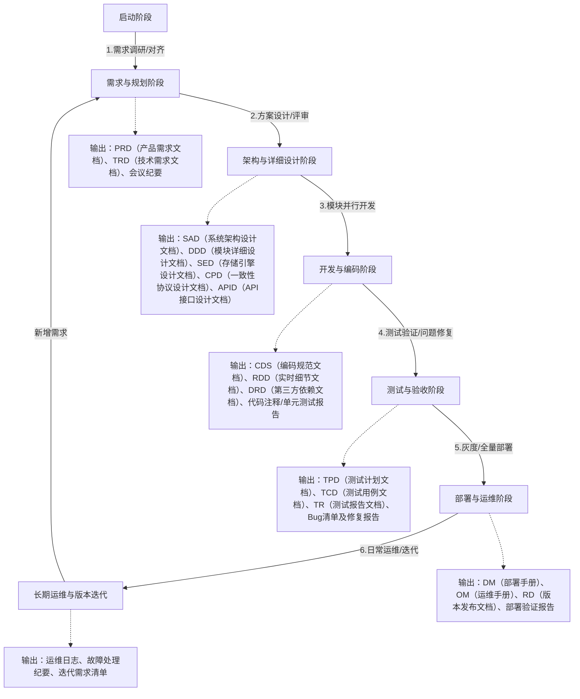
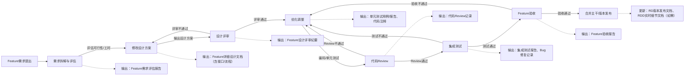

# NexKV 开发流程与文档管理规范

> **文档目的**：定义分布式KV存储系统的完整开发流程，包括各阶段的输出文档、责任人、时间周期和文档管理规范。

---

## 一、总体开发全流程（全生命周期）

### 1.1 流程可视化（Mermaid流程图）


   

### 1.2 各阶段详细说明

| 阶段 | 核心任务 | 时间周期 | 输出文档/成果 | 责任人 | 文档输出时机 |
|------|---------|---------|--------------|--------|------------|
| **启动阶段** | 明确项目目标、组建团队、对齐资源、确认技术栈边界 | 1-2天 | 项目立项报告、团队分工清单、技术栈选型文档 | 项目经理/架构师 | 阶段结束前半天 |
| **需求与规划** | 需求梳理、技术指标转化、需求评审、里程碑制定 | 2-3天（小Feature）<br/>1周（大Feature） | PRD、TRD、需求评审纪要、项目计划（PP） | 产品经理+架构师 | PRD：需求调研后1日；TRD：PRD评审通过后2日 |
| **架构与详细设计** | 系统架构设计、核心模块详细设计、接口设计、设计评审 | 1-2天（小Feature）<br/>1周（大Feature） | SAD、DDD、SED、CPD、APID、设计评审纪要 | 架构师+核心开发 | SAD：架构设计后1日；其余：模块设计后1日 |
| **开发与编码** | 环境搭建、编码规范制定、模块并行开发、代码Review、单元测试 | 3-5天（小Feature）<br/>1-2周（大Feature） | CDS、RDD、DRD、可运行代码、单元测试报告、Review记录 | 全体开发工程师 | CDS：开发启动前；RDD：核心流程完成后1日 |
| **测试与验收** | 测试计划制定、功能/性能/高可用测试、故障注入、Bug修复、验收 | 2-3天（小Feature）<br/>1周（大Feature） | TPD、TCD、TR、Bug清单、验收报告 | 测试工程师+开发 | TPD/TCD：测试启动前1日；TR：测试结束后1日 |
| **部署与运维** | 部署/运维手册编写、环境搭建、集群部署、部署验证、监控配置 | 1-2天 | DM、OM、RD、部署验证报告、监控告警配置 | 运维工程师+开发 | DM/OM：部署启动前1日；RD：发布前 |
| **长期运维与迭代** | 日常监控维护、故障排查、性能优化、需求收集、版本规划 | 长期（持续） | 运维日志、故障纪要、性能优化报告、迭代需求清单 | 运维+产品+开发 | 运维日志实时记录；优化报告完成后1日 |

二、 单个Feature开发流程（如：新增批量写入功能、优化Raft日志复制）

2.1 流程可视化（Mermaid流程图）



### 2.2 各阶段详细说明（含文档输出）

| 阶段 | 时间周期 | 核心动作 | 输出成果 | 输出时机 | 补充说明 |
|------|---------|---------|---------|---------|---------|
| **1. Feature需求提出** | 半天 | 业务方/产品提出Feature需求（如"支持批量KV写入，提升高并发写入效率"），明确需求背景、目标、验收标准 | Feature需求工单（含需求描述、优先级、预期效果） | 需求提出当天，录入项目管理工具（如Jira） | - |
| **2. 需求拆解与评估** | 半天 | 开发/架构师拆解需求，评估技术可行性、开发工时、对现有系统的影响（如批量写入对Raft日志的影响）、依赖模块 | Feature需求评估报告（含可行性结论、工时预估、影响范围、依赖模块、风险点） | 评估完成当天 | 风险点示例："批量写入可能导致日志膨胀，需增加日志分段机制" |
| **3. Feature设计** | 1天（小）<br/>2-3天（大） | 核心开发针对Feature设计实现方案，包括接口定义、流程设计、数据结构调整、与现有模块的交互逻辑 | Feature详细设计文档（含接口参数、流程图/Mermaid、数据结构、核心逻辑、异常处理方案、与现有系统的兼容性说明） | 设计完成后当天 | 示例：批量写入与存储引擎LSM-Tree的适配设计 |
| **4. 设计评审** | 1-2小时 | 组织开发/测试/架构师评审设计方案，重点检查可行性、合理性、对系统性能/一致性的影响 | Feature设计评审纪要（含评审意见、修改建议、最终确认的设计方案），同步更新Feature详细设计文档 | 评审结束当天 | - |
| **5. 任务分配与开发** | 1-3天（小）<br/>1周（大） | 项目经理分配开发任务，开发工程师基于设计方案编码，编写单元测试，记录开发过程中的关键细节 | 1. 单元测试用例及报告<br/>2. 代码注释（符合CDS编码规范） | 1. 单元测试报告：开发完成后当天<br/>2. 代码注释：编码同步完成 | 开发过程中若需调整设计，需重新发起设计评审 |
| **6. 代码Review** | 半天 | 开发工程师提交代码分支，指定核心开发/架构师进行Review，检查代码质量、逻辑正确性、符合编码规范、单元测试覆盖率 | 代码Review记录（含Review意见、问题清单、修改建议） | Review结束当天 | 开发工程师根据意见修改代码后重新提交Review |
| **7. 集成测试** | 1天（小）<br/>2-3天（大） | 测试工程师基于Feature需求和设计文档，执行集成测试，验证Feature功能正确性、与现有功能兼容性、性能指标 | 1. 集成测试报告<br/>2. Bug修复记录（实时更新） | 1. Bug修复记录：实时更新<br/>2. 集成测试报告：测试完成后当天 | Bug修复后需重新执行集成测试，确保问题解决 |
| **8. Feature验收** | 1-2小时 | 产品/业务方、开发、测试共同验收，验证Feature是否符合需求、验收标准是否达标 | Feature验收报告（含验收结果、未达标项、优化建议） | 验收结束当天 | 未通过则返回开发阶段调整 |
| **9. 合并主干/版本发布** | 半天 | 验收通过后，开发工程师将代码合并至主干分支，运维工程师同步更新版本发布文档，若Feature涉及核心流程变更，更新RDD实时细节文档 | 1. 更新RD版本发布文档（新增Feature说明）<br/>2. 更新RDD实时细节文档（如需） | 合并主干后当天 | 合并主干后需执行全量集成测试，确保不影响现有功能 |

三、 核心文档关联与代码目录存放规范

3.1 代码目录docs文件夹结构规划

所有文档统一放置在代码库根目录的 docs/ 文件夹下，按研发阶段分文件夹归档，文件命名遵循统一规范，便于开发人员快速定位、版本管理（与代码同步提交Git）。

3.1.1 docs文件夹目录结构


# 代码库根目录下docs文件夹结构
```plaintext
/docs
├── 01_requirement_planning/       # 需求与规划阶段文档
│   ├── PRD.md                     # 产品需求文档
│   ├── TRD.md                     # 技术需求文档
│   ├── requirement_review_minutes.md  # 需求评审纪要
│   └── project_plan.md            # 项目计划文档（PP）
├── 02_design/                     # 架构与详细设计阶段文档
│   ├── SAD.md                     # 系统架构设计文档
│   ├── DDD.md                     # 模块详细设计文档
│   ├── SED.md                     # 存储引擎设计文档
│   ├── CPD.md                     # 一致性协议设计文档
│   ├── APID.md                    # API接口设计文档
│   └── design_review_minutes.md   # 设计评审纪要
├── 03_development/                # 开发与编码阶段文档
│   ├── CDS.md                     # 编码规范文档（Go专项）
│   ├── RDD.md                     # 实时细节文档
│   ├── DRD.md                     # 第三方依赖文档
│   ├── unit_test_report/          # 单元测试报告目录（按模块分文件）
│   │   ├── api_unit_test.md
│   │   ├── raft_unit_test.md
│   │   └── storage_unit_test.md
│   └── code_review_records.md     # 代码Review记录汇总
├── 04_test/                       # 测试与验收阶段文档
│   ├── TPD.md                     # 测试计划文档
│   ├── TCD.md                     # 测试用例文档
│   ├── TR.md                      # 测试报告文档
│   ├── bug_list.md                # Bug清单及修复报告
│   └── acceptance_report.md       # 验收报告
├── 05_deployment_operation/       # 部署与运维阶段文档
│   ├── DM.md                      # 部署手册
│   ├── OM.md                      # 运维手册
│   ├── RD.md                      # 版本发布文档
│   ├── deployment_verification.md # 部署验证报告
│   └── monitor_alert_config.md    # 监控告警配置手册
├── 06_project_management/         # 项目管理与协作文档
│   ├── project_init_report.md     # 项目立项报告
│   ├── team_division.md           # 团队分工清单
│   └── meeting_minutes/           # 会议纪要目录（按日期命名）
│       ├── 202X-XX-XX_需求评审纪要.md
│       └── 202X-XX-XX_设计评审纪要.md
└── README.md                      # docs目录说明文档（指引各文件夹用途、文档查阅方式）
```

        

3.1.2 文档命名与存放规范

- 文件夹命名：以两位数字前缀+阶段名称（英文下划线分隔），按研发流程顺序排列，确保层级清晰（如 01_requirement_planning/）。
- 文件命名：核心文档用英文缩写（大写）+.md（如 PRD.md），辅助文档用中文描述+英文后缀（如 需求评审纪要.md），会议纪要按“日期+主题”命名，便于追溯。
- 版本管理：文档版本变更无需修改文件名，通过Git提交记录追溯（提交时备注版本变更内容）；核心文档首页注明当前版本、修改人、修改日期。
- 关联文件：测试用例、单元测试报告等按模块拆分文件，放入对应子目录，避免单个文件过大（如 unit_test_report/ 下按模块分文件）。

3.2 核心文档关联说明

💡 关键提示

1. 文档关联性：PRD→TRD→SAD→DDD→APID→开发编码→测试用例，上游文档为下游文档的输入依据，修改上游文档需同步更新下游关联文档，并在Git提交时注明关联文档变更。
2. 文档同步：文档与代码同步提交、同步迭代，开发人员在修改核心功能后，需同步更新对应设计文档（如修改Raft日志逻辑后，更新CPD.md和RDD.md）。
3. 权限管理：docs文件夹与代码库权限一致，团队成员均可查阅，核心文档（SAD、APID等）的修改需经过评审，避免随意变更。

💡 关键提示

1. 文档关联性：PRD→TRD→SAD→DDD→APID→开发编码→测试用例，上游文档为下游文档的输入依据，修改上游文档需同步更新下游关联文档。
2. 文档存储：所有文档统一存入项目知识库（如GitLab Wiki、Confluence），按阶段分类归档，版本号统一规范（如V1.0、V1.1），记录版本变更日志。
3. 文档维护：核心文档（如SAD、APID、RDD）由指定责任人维护，业务/技术变更后需及时更新，确保文档与系统实现一致。
