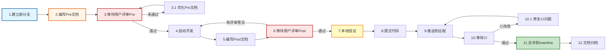
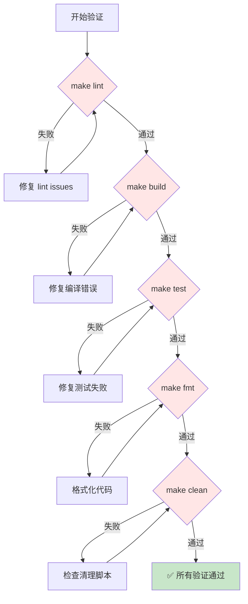

# NexKV 开发流程规范

> **完整定义**：从需求到交付的 12 步 PR 工作流程
>
> **核心理念**：Pre-Post 双文档 + 用户评审 + 完整验证

---

## 📋 目录

1. [流程概览](#流程概览)
2. [完整 12 步流程](#完整-12-步流程)
3. [文档规范](#文档规范)
4. [验证清单](#验证清单)
5. [Git 工作流](#git-工作流)
6. [角色与职责](#角色与职责)

---

## 流程概览

### 双文档驱动

```
Pre 文档（前置规划）          Post 文档（后置总结）
     ↓                            ↓
  需求+设计                     成果+总结
     ↓                            ↓
  用户评审 ←─────────────→    用户评审
     ↓                            ↓
 启动开发 ←─────────────→    推送合并
```

**核心原则**：
- ✅ Pre 文档**未通过评审前**，禁止启动开发
- ✅ Post 文档**未通过评审前**，禁止推送到远程
- ✅ 提交前**所有验证必须通过**（lint + build + test + fmt + clean）

---

## 完整 12 步流程



### 步骤详解

#### 步骤 1：建立新分支

```bash
# 命名规范：feature/{功能描述}
git checkout -b feature/update-workflow-validation
```

**分支类型**：
- `feature/{功能描述}` - 新功能开发
- `fix/{问题描述}` - Bug 修复
- `refactor/{模块名}` - 代码重构
- `docs/{文档名}` - 纯文档更新

---

#### 步骤 2：编写 Pre 文档（前置规划）

**文档位置**：`docs/06_PM/{type}/{YYYY-MM-DD}_PR-{简短标题}_Pre.md`

**文档内容**：
```markdown
# {功能名称} - Pre 文档

> **PR 类型**: feature / fix / refactor / doc
> **创建日期**: YYYY-MM-DD
> **状态**: 📋 待评审

---

## 1. 任务范围

### 1.1 背景
描述为什么需要这个任务

### 1.2 目标
明确要达成的目标（SMART 原则）

### 1.3 不包含的内容
明确不做什么（YAGNI 原则）

---

## 2. 背景与问题

### 2.1 当前问题
描述当前存在的具体问题

### 2.2 影响范围
分析问题的影响范围和严重程度

---

## 3. 目标与验收标准

### 3.1 功能目标
- [ ] 目标 1
- [ ] 目标 2

### 3.2 质量目标
- 单元测试覆盖率 ≥ 80%
- 代码质量：0 lint issues
- 性能指标：...

### 3.3 验收标准
明确的验收条件

---

## 4. 实施方案

### 4.1 技术方案
详细的技术实现方案

### 4.2 实施计划
分解任务和估算时间

### 4.3 风险评估
| 风险 | 可能性 | 影响 | 缓解措施 |
|------|--------|------|----------|
| ... | ... | ... | ... |

---

## 5. 参考资料
相关文档、Issue、设计文档链接
```

---

#### 步骤 3：等待用户评审 Pre 文档 ⚠️ **关键门禁**

**⚠️ 强制要求**：Pre 文档**必须**获得用户/架构师评审通过后，才能启动开发。

**评审流程**：
1. 提交 Pre 文档
   ```bash
   git add docs/06_PM/{type}/...Pre.md
   git commit -m "docs(pr): 编写 Pre 文档"
   ```

2. 创建 PR 或请求评审
   ```bash
   # 方式 1: 创建 PR（推荐）
   gh pr create --base main --head feature/xxx \
     --title "[Pre-Review] {功能名称}" \
     --body "Pre 文档待评审"

   # 方式 2: 直接请求评审
   echo "Pre 文档已完成，请评审：docs/06_PM/{type}/...Pre.md"
   ```

3. 等待评审反馈
   - ✅ **通过**：进入步骤 4（启动开发）
   - ❌ **未通过**：回到步骤 2（优化 Pre 文档）

**评审标准**：
- ✅ 需求明确：任务范围清晰，目标具体
- ✅ 设计合理：技术方案可行，风险评估充分
- ✅ 验收标准：有明确的验收条件和测试计划
- ✅ 文档完整：背景、目标、方案、风险都有覆盖

---

#### 步骤 4：启动开发

**⚠️ 检查点**：确保 Pre 文档已通过评审。

按照 Pre 文档中的实施方案进行开发：
1. 编写代码
2. 编写测试
3. 本地自测

---

#### 步骤 5：编写 Post 文档（后置总结）

**文档位置**：与 Pre 文档相同文件（追加内容）

**文档内容**：
```markdown
---

## 📊 Post 文档（后置总结）

> **完成日期**: YYYY-MM-DD
> **状态**: 📋 待评审

---

## 1. 核心成果总结

### 1.1 功能成果
- ✅ 已完成：...
- ⏳ 部分完成：...
- ❌ 未完成：...

### 1.2 技术成果
- 新增代码：XXX 行
- 删除代码：XXX 行
- 测试覆盖率：XX%
- 性能提升：...

---

## 2. 开发过程

### 2.1 关键决策
记录开发过程中的重要技术决策

### 2.2 遇到的问题与解决
| 问题 | 解决方案 | 经验教训 |
|------|----------|----------|
| ... | ... | ... |

### 2.3 偏离 Pre 文档的内容
说明与 Pre 文档的差异及原因

---

## 3. 测试与验证

### 3.1 测试结果
- ✅ make lint: 0 issues
- ✅ make build: 编译成功
- ✅ make test: 所有测试通过（包含竞态检测）
- ✅ make clean: 清理完成

### 3.2 代码覆盖率
```
模块           覆盖率    目标    状态
transport      76.1%    80%     ⚠️
metadata       82.3%    80%     ✅
...
```

---

## 4. 未完成项与后续计划

### 4.1 未完成项
- [ ] P1-2: xxx（性能优化）
- [ ] P1-3: xxx（功能增强）

### 4.2 后续建议
1. 下个 PR 可以优化...
2. 建议补充测试...

---

## 5. 提交记录

| Commit | 说明 | 时间 |
|--------|------|------|
| abc123 | feat(xxx): xxx | YYYY-MM-DD HH:MM |
| def456 | fix(xxx): xxx | YYYY-MM-DD HH:MM |

---

## 6. 参考资源
相关代码位置、测试用例、性能报告
```

---

#### 步骤 6：等待用户评审 Post 文档 ⚠️ **关键门禁**

**⚠️ 强制要求**：Post 文档**必须**获得用户/架构师评审通过后，才能执行提交和推送。

**评审流程**：
1. 提交 Post 文档
   ```bash
   git add docs/06_PM/{type}/...Pre.md
   git commit -m "docs(pr): 完善 Post 文档"
   ```

2. 请求评审
   ```bash
   echo "Post 文档已完成，请评审：docs/06_PM/{type}/...Pre.md"
   ```

3. 等待评审反馈
   - ✅ **通过**：进入步骤 7（本地验证）
   - ❌ **有意见**：回到步骤 4（补充开发）或步骤 5（完善 Post 文档）

**评审标准**：
- ✅ 功能完整：Pre 文档中的目标全部达成
- ✅ 质量达标：测试覆盖率达标，无严重 Bug
- ✅ 文档完整：Post 文档内容完整、准确
- ✅ 验收通过：满足 Pre 文档中的验收标准

---

#### 步骤 7：本地验证 ⚠️ **强制要求**

**⚠️ 强制要求**：提交前**所有验证项必须通过**，缺一不可。

**完整验证清单**：
```bash
# === 步骤 1: 代码简化（可选） ===
# 使用 code-simplifier agent 优化代码结构

# === 步骤 2: 代码质量检查 ===
make lint
# ⚠️ 必须通过：0 issues

# === 步骤 3: 编译验证 ===
make build
# ⚠️ 必须通过：编译成功

# === 步骤 4: 单元测试 + 竞态检测 ===
make test
# ⚠️ 必须通过：所有测试用例通过（包含 -race 竞态检测）

# === 步骤 5: 代码格式化 ===
make fmt
# ⚠️ 必须通过：代码格式符合规范

# === 步骤 6: 清理构建产物 ===
make clean
# ⚠️ 必须通过：清理完成

# === 步骤 7: 验证结果检查 ===
echo $?  # 确保上一个命令返回 0
```

**验证说明**：

| 验证项 | 说明 | 失败处理 |
|--------|------|---------|
| **make lint** | 代码质量检查（golangci-lint） | 修复所有 lint issues，重新运行 |
| **make build** | 编译项目（含 Protobuf） | 修复编译错误，重新运行 |
| **make test** | 运行所有测试（单元+集成，含竞态检测） | 修复测试失败，重新运行 |
| **make fmt** | 代码格式化（gofmt/goimports） | 格式化代码，重新运行 |
| **make clean** | 清理构建产物 | 确保清理成功 |

**快速验证命令**（一行执行）：
```bash
# 注意：code-simplifier 需要在 Claude Code 中单独运行
make lint && make build && make test && make fmt && make clean && echo "✅ 所有验证通过"
```

**⚠️ 重要**：
- **顺序执行**：lint → build → test → fmt → clean
- **缺一不可**：所有验证项必须通过，否则禁止提交
- **修复循环**：任何验证失败，修复后重新执行完整流程

---

#### 步骤 8：提交代码

**⚠️ 检查点**：
1. ✅ Pre 文档已通过评审
2. ✅ Post 文档已通过评审
3. ✅ 所有本地验证通过

**提交规范**：
```bash
# 添加所有变更
git add .

# 提交（遵循 Conventional Commits 规范）
git commit -m "feat(scope): description

详细说明（可选）

关联 Pre 文档：docs/06_PM/{type}/..."
```

**提交类型**：
- `feat`: 新功能
- `fix`: Bug 修复
- `refactor`: 代码重构
- `docs`: 文档更新
- `test`: 测试相关
- `chore`: 构建/工具相关

---

#### 步骤 9：推送到远程

**⚠️ 检查点**：
1. ✅ Post 文档已通过评审
2. ✅ 所有本地验证通过
3. ✅ 代码已提交

```bash
# 推送分支到远程
git push origin feature/{功能描述}
```

**GitHub 会自动提示创建 PR**：
```
remote:
remote: Create a pull request for 'feature/xxx' on GitHub by visiting:
remote:      https://github.com/jzhang405/NexKV/pull/new/feature/xxx
remote:
```

---

#### 步骤 10：等待 CI

**CI 自动执行**（GitHub Actions）：
- 编译验证
- 单元测试
- 代码覆盖率
- 竞态检测
- Lint 检查

**⚠️ CI 通过后通知机制**：
```
CI 通过 → 通知用户/架构师 → 等待合并确认
```

**处理 CI 失败**：
1. 查看 CI 日志，定位失败原因
2. 本地修复问题
3. 重新提交并推送
   ```bash
   git add .
   git commit -m "fix(ci): 修复 CI 问题"
   git push
   ```

**处理 CI 通过**：
1. **⚠️ 立即通知用户/架构师**
   ```bash
   # 方式 1: 直接告知
   echo "make ci passed"

   # 方式 2: 发送 PR 通知
   gh pr comment --body "✅ CI 已通过，请评审并批准合并"

   # 方式 3: 等待用户主动查看
   # 用户会在 GitHub 页面看到 PR 状态变为 "All checks have passed"
   ```
2. **等待用户/架构师确认合并**
   - 用户/架构师审查 PR 内容
   - 用户/架构师确认后执行合并操作
   - **⚠️ 禁止自动合并，必须等待人工确认**

---

#### 步骤 11：合并到 mainline

**⚠️ 强制要求**：
1. ✅ CI 验证通过
2. ✅ **用户/架构师收到"make ci passed"通知**
3. ✅ **用户/架构师确认后执行合并**

**⚠️ 重要**：禁止 AI 助手自动合并，必须等待用户/架构师明确确认。

**用户/架构师确认方式**：
```bash
# 方式 1: 直接输入确认命令
make ci passed  # 然后执行合并操作

# 方式 2: 在对话中确认
"CI 通过了，可以合并"
"ok"  # 确认合并

# 方式 3: 在 GitHub PR 页面点击 "Merge pull request"
```

**合并方式**（由用户/架构师执行）：
```bash
# 方式 1: 通过 GitHub UI（推荐）
# 在 PR 页面点击 "Merge pull request"

# 方式 2: 使用 gh cli
gh pr merge --merge

# 方式 3: 本地合并
git checkout main
git pull origin main
git merge feature/{功能描述}
git push origin main
```

**合并后清理**：
```bash
# 删除本地分支
git branch -d feature/{功能描述}

# 删除远程分支
git push origin --delete feature/{功能描述}
```

---

#### 步骤 12：文档归档

**归档位置**：`docs/06_PM/{type}/{YYYY-MM-DD}_PR-{标题}_全流程.md`

**归档内容**：
1. Pre 文档（前置规划）
2. Post 文档（后置总结）
3. 代码审查报告（如有）
4. 测试报告（如有）
5. 性能分析（如有）

---

## 文档规范

### Pre 文档模板

```markdown
# {功能名称} - Pre 文档

> **PR 类型**: feature / fix / refactor / doc
> **创建日期**: YYYY-MM-DD
> **状态**: 📋 待评审 / ✅ 已通过 / ❌ 需优化

---

## 1. 任务范围

### 1.1 背景
{为什么需要这个任务}

### 1.2 目标
{明确要达成的目标}

### 1.3 不包含的内容
{明确不做什么}

---

## 2. 背景与问题

### 2.1 当前问题
{描述当前存在的具体问题}

### 2.2 影响范围
{分析问题的影响范围和严重程度}

---

## 3. 目标与验收标准

### 3.1 功能目标
- [ ] 目标 1
- [ ] 目标 2

### 3.2 质量目标
- 单元测试覆盖率 ≥ 80%
- 代码质量：0 lint issues

### 3.3 验收标准
{明确的验收条件}

---

## 4. 实施方案

### 4.1 技术方案
{详细的技术实现方案}

### 4.2 实施计划
{分解任务和估算时间}

### 4.3 风险评估
| 风险 | 可能性 | 影响 | 缓解措施 |
|------|--------|------|----------|
| ... | ... | ... | ... |

---

## 5. 参考资料
{相关文档、Issue、设计文档链接}
```

### Post 文档模板

```markdown
---

## 📊 Post 文档（后置总结）

> **完成日期**: YYYY-MM-DD
> **状态**: 📋 待评审 / ✅ 已通过

---

## 1. 核心成果总结

### 1.1 功能成果
- ✅ 已完成：...
- ⏳ 部分完成：...
- ❌ 未完成：...

### 1.2 技术成果
- 新增代码：XXX 行
- 删除代码：XXX 行
- 测试覆盖率：XX%

---

## 2. 开发过程

### 2.1 关键决策
{记录开发过程中的重要技术决策}

### 2.2 遇到的问题与解决
| 问题 | 解决方案 | 经验教训 |
|------|----------|----------|
| ... | ... | ... |

---

## 3. 测试与验证

### 3.1 本地验证结果
- ✅ make lint: 0 issues
- ✅ make build: 编译成功
- ✅ make test: 所有测试通过（包含竞态检测）
- ✅ make clean: 清理完成

### 3.2 代码覆盖率
{覆盖率报告}

---

## 4. 未完成项与后续计划

### 4.1 未完成项
- [ ] P1-2: xxx
- [ ] P1-3: xxx

### 4.2 可选优化（非阻塞）

**性能优化**（P1 问题）：
- P1-2: xxx（性能优化项）
- P1-3: xxx（性能优化项）
- P1-4: xxx（功能完善项）

**代码风格优化**（P2 问题）：
- P2-1: xxx（代码风格）
- P2-2: xxx（代码风格）
- ...（其他 P2 问题）

> **说明**：以上优化项非本次 PR 必须完成的内容，可在后续 PR 中根据优先级处理。

### 4.3 后续工作方向

**方案 1：继续完善当前模块**
- 建议 1：xxx
- 建议 2：xxx

**方案 2：处理其他模块**
- 模块 A：xxx
- 模块 B：xxx

**方案 3：根据项目优先级**
- 优先级 1：xxx
- 优先级 2：xxx

---

## 5. 提交记录

| Commit | 说明 | 时间 |
|--------|------|------|
| ... | ... | ... |
```

---

## 验证清单

### 提交前强制验证 ⚠️

**⚠️ 以下验证项必须全部通过，缺一不可**：

```bash
# === 完整验证流程 ===

# 步骤 1: 代码质量检查
make lint
# ⚠️ 必须通过：0 issues

# 步骤 2: 编译验证
make build
# ⚠️ 必须通过：编译成功

# 步骤 3: 单元测试 + 竞态检测
make test
# ⚠️ 必须通过：所有测试用例通过（包含竞态检测）

# 步骤 4: 代码格式化
make fmt
# ⚠️ 必须通过：代码格式符合规范

# 步骤 5: 清理构建产物
make clean
# ⚠️ 必须通过：清理完成
```

**快速验证命令**：
```bash
make lint && make build && make test && make fmt && make clean && echo "✅ 所有验证通过"
```

### 验证失败处理流程



---

## Git 工作流

### 分支策略

```
main（主分支）
├── feature/*（功能分支）
├── fix/*（修复分支）
├── refactor/*（重构分支）
└── docs/*（文档分支）
```

### 提交规范

**Conventional Commits** 格式：
```
<type>(<scope>): <subject>

<body>

<footer>
```

**类型（type）**：
- `feat`: 新功能
- `fix`: Bug 修复
- `refactor`: 代码重构
- `docs`: 文档更新
- `test`: 测试相关
- `chore`: 构建/工具相关

**示例**：
```bash
git commit -m "feat(rpc): 完善错误类型定义

- 修复 rpc_client.go 中 7 处错误处理
- 修复 rpc_server.go 中 7 处错误处理
- 统一使用 types.NewRPC* 系列函数

关联 Pre 文档：docs/06_PM/{type}/..."
```

### 禁止操作

❌ **以下操作被严格禁止**：
- 禁止直接合并到 main 分支（绕过 PR 流程）
- 禁止在未完成验证的情况下推送代码
- 禁止在未获得评审通过的情况下启动开发
- **禁止 AI 助手自动合并，必须等待用户/架构师明确确认（"make ci passed"）**
- 禁止跳过 Pre 或 Post 文档评审环节

---

## 角色与职责

### 👤 架构师（用户）

**职责**：
- ✅ **评审 Pre 文档**：批准后才能启动开发（步骤 3）
- ✅ **评审 Post 文档**：批准后才能推送代码（步骤 6）
- ✅ **接收 CI 通过通知**：AI 助手会通知"make ci passed"（步骤 10）
- ✅ **确认并执行合并**：收到通知后明确确认，然后执行合并（步骤 11）

**评审时机**：
- Pre 文档编写完成后（步骤 3）
- Post 文档编写完成后（步骤 6）
- CI 通过后，收到"make ci passed"通知（步骤 10-11）

**确认方式**：
```bash
# 方式 1: 直接命令
make ci passed

# 方式 2: 对话确认
"CI 通过了，可以合并"
"ok"

# 方式 3: GitHub UI 操作
# 在 PR 页面点击 "Merge pull request"
```

**⚠️ 重要**：
- 禁止 AI 助手自动合并
- 必须等待架构师明确确认后才能合并

### 🤖 核心开发

**职责**：
- 编写 Pre 文档（步骤 2）
- 等待架构师评审 Pre（步骤 3）
- 按照实施方案开发（步骤 4）
- 编写 Post 文档（步骤 5）
- 等待架构师评审 Post（步骤 6）
- 执行完整验证流程（步骤 7）
- 提交并推送代码（步骤 8-9）
- **等待 CI 通过后通知架构师**（步骤 10）⚠️ 关键
- **等待架构师确认后执行合并**（步骤 11）⚠️ 禁止自动合并

**CI 通过通知方式**：
```bash
# 方式 1: 直接告知
echo "make ci passed"

# 方式 2: PR 评论
gh pr comment --body "✅ CI 已通过，请评审并批准合并"

# 方式 3: 等待架构师主动查看
```

**⚠️ 重要**：
- CI 通过后必须立即通知架构师
- 禁止自动合并，必须等待架构师确认

### 🤖 代码审查工程师

**职责**：
- 代码质量审查（Code Review Agent）
- 代码简化优化（Code Simplifier Agent）
- 生成审查报告

---

## 快速参考

### PR 流程检查清单

**Pre 文档阶段**：
- [ ] 创建 feature 分支
- [ ] 编写 Pre 文档（背景、目标、方案、风险）
- [ ] **等待架构师评审 Pre** ⚠️ 关键门禁
- [ ] Pre 文档通过后，启动开发

**开发阶段**：
- [ ] 按照 Pre 文档实施开发
- [ ] 编写测试
- [ ] 本地自测

**Post 文档阶段**：
- [ ] 编写 Post 文档（成果、测试、未完成项）
- [ ] **等待架构师评审 Post** ⚠️ 关键门禁
- [ ] Post 文档通过后，准备提交

**验证阶段**：
- [ ] make lint（0 issues）
- [ ] make build（编译成功）
- [ ] make test（所有测试通过，包含竞态检测）
- [ ] make fmt（格式化通过）
- [ ] make clean（清理完成）

**提交阶段**：
- [ ] 提交代码
- [ ] 推送到远程
- [ ] 等待 CI 验证
- [ ] CI 通过后，等待架构师批准合并
- [ ] 合并到 mainline
- [ ] 删除分支

---

## 附录

### 相关文档

- `docs/CLAUDE.md` - NexKV 项目指南
- `docs/06_PM/` - PR 文档归档（子目录：feature/、fix/、refactor/、doc/）
- `docs/03_development/01_编码规范文档.md` - 编码规范
- `docs/04_test/01_测试计划文档.md` - 测试指南

### 工具参考

- **Git**: https://git-scm.com/doc
- **GitHub CLI**: https://cli.github.com/manual/
- **Go Testing**: https://golang.org/pkg/testing/
- **golangci-lint**: https://golangci-lint.run/

---

**文档版本**: v3.0
**创建日期**: 2026-01-27
**最后更新**: 2026-03-01
**维护者**: NexKV 开发团队
**状态**: ✅ 已批准
